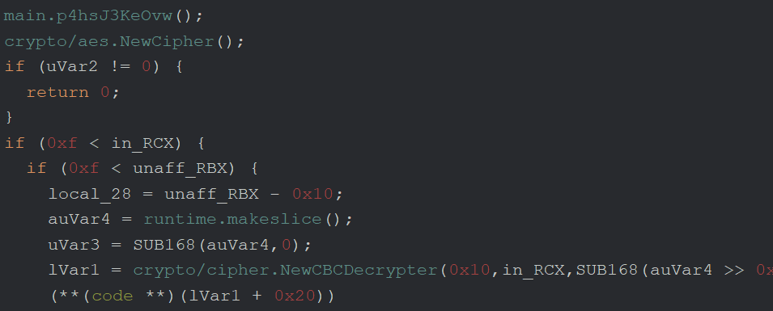

# Task 8 - Raiding the Vault

<div align="center">


</div>

> You're an administrator! Congratulations!
>
> It still doesn't look like we're able to find the key to recover the victim's files, though. Time to look at how the site stores the keys used to encrypt victim's files. You'll find that their database uses a "key-encrypting-key" to protect the keys that encrypt the victim files. Investigate the site and recover the key-encrypting key.
>
> Prompt:
>
> - Enter the base64-encoded value of the key-encrypting-key

## Solution

### Poking around

Now that we have access to the admin page, how about we poke around? :)
Creating a user sounds interesting, let's try that:

<div align="center">

</div>

Oh well, it was worth a try. We get a similar error when trying to delete users as well, so no wreaking havoc for us :( Adding credit needs a receipt like the unlock page, so that's probably a no-go as well.
The retrieve log button does seem to work, though: let's check out the log it prompts us to download:

```shell
$ head -n 10 keygeneration.log
2021-01-05T01:39:02-05:00       NervousPup      38329   5.342
2021-01-09T03:27:38-05:00       SuccessfulBarstool      24574   0.266
2021-01-24T06:20:31-05:00       DerangedStoryboard      15169   1.584
2021-01-25T18:09:23-05:00       FuzzyShower     30951   7.542
2021-02-04T00:54:11-05:00       SubstantialSynergy      13733   7.784
2021-02-11T06:04:05-05:00       AbashedGuerrilla        32724   9.373
2021-02-13T04:26:05-05:00       DerangedStoryboard      34772   5.4879999999999995
2021-02-13T18:54:15-05:00       LudicrousBlood  10350   5.154
2021-02-17T09:17:11-05:00       BraveShipyard   37730   6.329
2021-02-17T17:28:12-05:00       CrowdedBother   15408   9.618
```

Interesting, it seems to have four fields per row. We can check exactly what it's logging in [`app/server.py`](../task-B2/server-files/app/server.py#L97-L98) as recovered in task B2:

```python
    # -- snip --
        with open("/opt/ransommethis/log/keygeneration.log", 'a') as logfile:
            print(f"{datetime.now().replace(tzinfo=None, microsecond=0).isoformat()}\t{util.get_username()}\t{cid}\t{request.args.get('demand')}", file=logfile)
```

So the log includes a timestamp with microseconds removed, a username, a CID (customer/contract ID? not entirely sure :)), and the demanded amount of RansomCoin. Maybe it also includes the key generated by our attacker? We can check by cross-referencing the CID from the request made in [task B1](../task-B1/README.md):

```text
2022-03-31T10:07:28-04:00     X-RatedSnowboarding     64187 2.88
```

Aha! We'll see if that comes in useful later :)

While we're looking through server.py, why don't we also look at how the log is fetched?

```python
def fetchlog():
    log = request.args.get('log')
    return send_file("/opt/ransommethis/log/" + log)
```

Another hidden query argument that isn't sanitized! It really would be a shame if we could download files other than the key generation log from the server :)

### Downloading all the things

Based on [app/util.py](../task-B2/server-files/app/util.py#L25-L41), we already know the locations of a couple databases:

```python
@contextmanager 
def victimdb():
    victimdb = "/opt/ransommethis/db/victims.db"
    try:
        con = sqlite3.connect(victimdb)
        yield con
    finally:
        con.close()

@contextmanager
def userdb():
    userdb = f"/opt/ransommethis/db/user.db"
    try:
        con = sqlite3.connect(userdb)
        yield con
    finally:
        con.close()
```

We can then fetch these directly using by providing `../db/victims.db` and `../db/user.db` as the log query argument to the URL `https://iulplkticahjbflq.ransommethis.net/adrlarozeijppjmg/fetchlog?log=`. I've included them in the [recovered/](./recovered/) folder if you want to look at them yourself.

We know that `user.db` has at least two tables, `UserInfo` and `Accounts`, based on what's referenced in the website backend. `UserInfo` just seems to have boring information we already have, but what about `Accounts`?

```shell
$ sqlite3 -column -header user.db "SELECT * FROM Accounts LIMIT 5"
userName             uid    secret                            isAdmin  pwhash                                                                                    pwsalt
-------------------  -----  --------------------------------  -------  ----------------------------------------------------------------------------------------  ----------------------
X-RatedSnowboarding  26960  1uT153kUHMMHrqqqEKak0KSqyS4vdwTi  0        XkmyJigGVHdSXphNEq3NVlbhQzD9++f/amX2rOSRHMwHi+r267J5Ov21j584RmAiesR7/bgNPgcydd4L7KPx9A==  7zZGdafQUoJ30DBWnYsNGw
NervousHiccups       16498  TQ9mpDdETkLCarLuyggyK8eDvJYESLjA  1        QAz7GP+1dej94ZCauI2Xow9AWSa6VXRGHFDgYVI7liiVsMNsoJDKzB4leFyLGAvNk+mtUy4TZiybkgm+2XV07g==  MaJOezDtq__fHVlKPbkLmA
SuccessfulBarstool   33047  BIxMiC2ZnOG4wh1sY85WVb0VpbpDMEsn  0        iyJ4NLQWZXiHZzX7RT7/5XJfcSZLMNcZqwgGGJX7DHmbCbsKQGKVqn4iYs0PZ0tH4AFro0IXWz1hrfVkllNPoA==  AMzuJXyMOxUdoXU0gvy_OA
LudicrousBlood       37159  UcpQw9FMQixTQ7ID67N3FTiOW7CgznGN  0        2aOt7KF21xwi7/bic8wlIZ/H+BQ+uQ5CNa2Nfn9LzzEuo0GIhmzUVowPKXS7NlCUfwJUUpgzzDw9BA+ptaUC7w==  URg3rWd_cvCAfcNFdt50KQ
ZealousGrab-Bag      20091  BJ4wJOxQT1sTJNL1fV0G0dMsK3Nn6WZQ  0        y+ZpjqJSPo8op85oLeX2ms/GTq54ZdX67j3OUxCY8nLbjMmXhl7Uks0MIxML3YyRpimqMqdmY+3JkDEA9sslOQ==  XoXQFa_hyivBXHzkqrCHUg
```

Would you look at that, all of the users' secrets stored in plaintext :) I guess at this point we could impersonate any of them if we wanted to, but we're already an admin so there's not much point to doing that.

`victims.db`, on the other hand, only seems to have one table: `Victims`. Let's check it out:

```shell
$ sqlite3 -column -header victims.db "SELECT * FROM Victims LIMIT 5"
cid      dueDate     Baddress                pAmount
-------  ----------  ----------------------  -------
64187    1651327551  zfxpCLbCTw_icgi_89Ut8A  2.88
7419697  1647250370  huPd5F-9c5DjZIDaHowpDA  9.315
5803674  1655123983  HnDRrMMsW8pRYT-MFTITOQ  9.818
6676129  1650872119  1pdCvZPw7G4aGLLy-zjvfw  3.156
8532629  1649658120  7GgTsAAx_DzjGaD0ehetTg  4.042
```

That first one seems to match our cid, but again, we already knew all of this information from prior tasks.

The only other file directly referenced by the server backend is located at `/opt/keyMaster/keyMaster`. It seems to be the binary responsible for managing ransomware encryption keys, since it's called from [within the `lock()`/`unlock()` functions](../task-B2/server-files/app/server.py#L80-L111) in app/server.py. We can then download it from the URL https://iulplkticahjbflq.ransommethis.net/adrlarozeijppjmg/fetchlog?log=../../keyMaster/keyMaster. Just to verify that it's a binary executable, let's run file on it:

```shell
$ file keyMaster
keyMaster: ELF 64-bit LSB executable, x86-64, version 1 (SYSV), dynamically linked, interpreter /lib64/ld-linux-x86-64.so.2, for GNU/Linux 3.2.0, Go BuildID=S7Hht993YmFd63cpMHGi/mE9brC__hl9NxH22rtEv/SAHTA9MDm4RHcuRq1vkQ/-yKTG9e3m9DoQia4vWh1, BuildID[sha1]=1fab7db8e8acf7437227c572b8b666d5fde2a449, stripped
```

A Go build ID huh? Analyzing this binary will be fun then :)

### Reversing `keyMaster`

Go binaries have tons of functions since all (Go) libraries are compiled into the final binary, so normally analyzing a stripped Go binary in Ghidra would be extremely painful.
However, people way smarter than me have discovered that you can actually recover function names in a Go binary because they aren't fully removed in the stripping process.
You can read more about their approach [here](https://cujo.com/reverse-engineering-go-binaries-with-ghidra/) if you're curious.

After opening up `keyMaster` and using the scripts from that blog post, we're left with a much more manageable set of functions, including a handful that start with `main.`:

<div align="center">

</div>

I went through all of them one by one (except `main.main` since it's really long) when I initially did this task, but I'll only include notes on the interesting ones here. My more complete notes from task 8 are located [here](./notes%20-%20task%208.txt) if you're curious, although I can't make any guarantees of their intelligibility :)

#### `main.DchO32CDDK0`

This functions starts with a bunch of local declarations courtesy of Ghidra, but it does have some interesting function calls right after that:

<div align="center">

</div>

Referencing the [`google/uuid` documentation](https://pkg.go.dev/github.com/google/UUID#NewUUID) tells us that a version 1 UUID is being generated as part of this function.
Version 1 UUIDs are interesting because the time they are generated is encoded into them in a specific way (more information on that [here](https://www.uuidtools.com/uuid-versions-explained)).
To avoid collisions caused by daylight savings transitions, they can also include a clock sequence that's included in the generation process.
In this case, the clock sequence seems to be read from the `CLOCK_SEQUENCE` environment variable, meaning that it probably isn't randomized.

#### `main.OTMX1OW4JrU`

This is a shorter function but does still have interesting calls:

<div align="center">

</div>

The file being read seems to be `./receipt.pub`:

<div align="center">

</div>

Based on how it's named, maybe the receipts required to credit a user or to unlock a ransom are JWTs? Given how they were used for authentication it would make sense if this ransomware company also used them for other things.
Unfortunately we can't download the `receipt.pub` key from the server so we can't forge receipts, but we can generate our own key to forge local ones (I ended up doing that but it didn't end up proving useful so I didn't include it in this writeup).

#### `main.XL95gzwGuD8`

This function appears to open a connection to the database `./keyMaster.db`:

<div align="center">

</div>

Based on the [`database/sql` library documentation](https://pkg.go.dev/database/sql#Open), `sqlite3` seems to be the database driver, and `./keyMaster.db` the database that's being opened. Since the `keyMaster` binary is known to be located at `/opt/keyMaster/keyMaster`, that means that its database is located at `/opt/keyMaster/keyMaster.db`. Knowing that, we can then download it like we did `keyMaster` and the other databases :)

Because SQLite stores a [schema table](https://www.sqlite.org/schematab.html) in every database, we can use that to figure out which tables `keyMaster.db` has:

```shell
$ sqlite3 -column -header keyMaster.db "SELECT name FROM sqlite_schema"
name
---------
customers
hackers
```

`customers` and `hackers`, got it. Let's take a peek at both of them:

```shell
$ sqlite3 -column -header keyMaster.db "SELECT * FROM hackers LIMIT 5"
hackerName           credits
-------------------  -------
X-RatedSnowboarding  0

$ sqlite3 -column -header keyMaster.db "SELECT * FROM customers LIMIT 5"
customerId  encryptedKey                                                                              expectedPayment  hackerName      creationDate
----------  ----------------------------------------------------------------------------------------  ---------------  --------------  -------------------------
23445       NLfbNhII+dI4sV5rRLQua5xffSUHgKHvDwsVO+NCxX07eAvcjhAvYMapRMuf5sk+6F8JHV88+3tMkYDiV/CARA==  6.686            LudicrousBlood  2021-08-29T02:22:11-04:00
41855       UqpzdAzUjDLv1gtCIIYUYtb5xtl7vU3o0q5WHClaw61ZOmy3xUyWad2A8m+IXFJ0h+PqrJCc4ZjrPmwJzZY/lA==  2.491            NervousPup      2021-07-09T17:24:55-04:00
27158       I4+XrSd7FqNhaVctIuqevogZYd5LNMTCUuBJ24jQef+RZi9//JdDC32ddQOhPQ/f23/FbYxebU3Cg6yYzvvlYg==  6.276            NervousHiccups  2021-07-31T16:35:52-04:00
48048       lzNq5uD2heZvfqcUiQm2uHeDzfKs7UyBFrZjenN/xdlu4spBv5rZ0iVFU3zWPH4H7CtGrad2nMWW1mFS1QbIDQ==  6.759            BraveShipyard   2021-08-24T23:01:23-04:00
32689       +iVICerbw8gcaZum4WSj7/CXes5HcsEMn5fLzSTho0eFjNmbGJjTngjDtFTtvJQLmgM8zE4liGZBtF227fNNKg==  4.085            FuzzyShower     2021-02-20T10:40:35-05:00
```

Huh, guess we're the only hacker at this point? That seems a bit weird.
In other news though, the `customers` table stores all of the encrypted keys in what seems to be base64! On the off chance that they're not actually encrypted, let's try decoding one of them:

```shell
$ echo NLfbNhII+dI4sV5rRLQua5xffSUHgKHvDwsVO+NCxX07eAvcjhAvYMapRMuf5sk+6F8JHV88+3tMkYDiV/CARA== | base64 -d
4��6��8�^kD�.k�_}%���
                     ;�B�};x
                             ܎/`ƩD˟��>�_       _<�{L���W�D
```

...yeah that's what I figured. Guess it was worth a shot ¯\\\_(ツ)\_/¯

I wonder if the key for our client is also there?

```shell
$ sqlite3 -column -header keyMaster.db "SELECT * FROM customers WHERE customerId = 64187 LIMIT 5"
$
```

Huh, so that's probably the data loss the website was talking about. Guess they *had* to make our job harder huh.
This database is still really nice, though, since it'll let us verify if we get the correct key-encryption-key :)

#### `main.mTXY69XKhIw`

This function seems to be where the key decryption happens, probably when a user unlocks a key with a receipt:

<div align="center">

</div>

So now we know that the keys are probably encrypted with AES in CBC mode. I'll go more into what that means later, but in case you're curious now there's a [Wikipedia article](<https://en.wikipedia.org/wiki/Block_cipher_mode_of_operation#Cipher_block_chaining_(CBC)>) explaining what CBC is.

The call to `main.p4hsJ3KeOvw` might return a key, which based on the task instructions as well as the fact that AES is a symmetric cipher (i.e. the same key is used for both encryption and decryption) should be consistent across multiple runs of the keyMaster binary. If we're lucky maybe it's just returned as a byte slice without any shenanigans happening? (hint: it's not)

#### `main.p4hsJ3KeOvw`

The first interesting thing this function seems to do is decode the Base64 string `oWBy7HUKZqhBCkqEDwsYeebaK12aDi2Jz3ftqWCLxZ8=`:

<div align="center">

</div>

Given that there's more to the function, though, that probably isn't our key-encrypting-key :(

After that, there's a loop that seems to xor the following hard-coded byte sequences together, wrapping the smaller one around until the full longer one is covered if that makes sense:

```text
Longer: bcccd04a512ffad511bdb418e6591bb0c2802e166ddbdf7ba48748dc4437afbae650193ecaee75b1be739f570891a2fb5e6618e6c163fb8f479f5421cfadc16f7105cdd278bba04d9c6f07b7aed65f690fe9ce6fb8b01c92
Shorter: f9f4b518205cbfa73ac9d721af2152
```

After sticking those into [CyberChef](<https://gchq.github.io/CyberChef/#recipe=From_Hex('Auto')XOR(%7B'option':'Hex','string':'f9f4b518205cbfa73ac9d721af2152'%7D,'Standard',false)&input=YmNjY2QwNGE1MTJmZmFkNTExYmRiNDE4ZTY1OTFiYjBjMjgwMmUxNjZkZGJkZjdiYTQ4NzQ4ZGM0NDM3YWZiYWU2NTAxOTNlY2FlZTc1YjFiZTczOWY1NzA4OTFhMmZiNWU2NjE4ZTZjMTYzZmI4ZjQ3OWY1NDIxY2ZhZGMxNmY3MTA1Y2RkMjc4YmJhMDRkOWM2ZjA3YjdhZWQ2NWY2OTBmZTljZTZmYjhiMDFjOTI>), the result turns out to be `E8eRqsEr+tc9IxII65661dxAmPiseeVNSH9buIOxiR0vZhVNFFDYfY2Xf0us6YtwQYruBrwl3NUNZcGISViUqg==` which is...a valid Base64 string again? What's with this ransomware company and Base64?

Anyways, after all of that the function uses [PBKDF2](https://en.wikipedia.org/wiki/PBKDF2) to generate what we can assume is the AES encryption key:

<div align="center">

</div>

I guess now is probably a good time to mention that Go has weird conventions for calling functions, which are detailed in [this document](https://go.googlesource.com/go/+/refs/heads/dev.regabi/src/cmd/compile/internal-abi.md).
In this case we care about how arguments are passed to functions:

<div align="center">

</div>

Luckily the registers are loaded in order, but we do have to go through the rest of the function to figure out what would be in them at this point :(

Also mentioned in the calling conventions document is how slices and strings are passed to functions:

> The slice type `[]T` is a sequence of a `*[cap]T` pointer to the slice backing store, an `int` giving the len of the slice, and an `int` giving the cap of the slice.
>
> The `string` type is a sequence of a `*[len]byte` pointer to the string backing store, and an `int` giving the len of the string.

This means that a slice is actually represented by three arguments and strings as two arguments for function calls, which I thought was interesting.

Anyways, tracing through the function and cross-referencing those results with the signature of [`pbkdf2.Key()`](https://pkg.go.dev/golang.org/x/crypto/pbkdf2#Key) lets us figure out the parameters for the PBKDF2 key derivation:

- `password` (`RAX`, `RBX`, `RCX`) -> Base64 string resulting from xoring mentioned earlier (**not** decoded) along with the length/capacity `0x58`: `E8eRqsEr+tc9IxII65661dxAmPiseeVNSH9buIOxiR0vZhVNFFDYfY2Xf0us6YtwQYruBrwl3NUNZcGISViUqg==`
- `salt` (`RDI`, `RSI`, `R8`) -> **decoded** Base64 string from early on in the function (`oWBy7HUKZqhBCkqEDwsYeebaK12aDi2Jz3ftqWCLxZ8=`) as well as its length (`0x2c`, which seems to be for the original string). I'm still a bit confused what `RSI` points to at this point but it should be the length or capacity of the decoded Base64 byte slice.
- `iter` -> 0x1000 hex (4096 decimal)
- `keyLen` -> 0x20 hex (32 decimal)
- `h` -> the `crypto/sha256.New()` function, meaning that this PBKDF2 is based on SHA256 HMAC

Shoving all of that information into [CyberChef](<https://gchq.github.io/CyberChef/#recipe=Derive_PBKDF2_key(%7B'option':'UTF8','string':'E8eRqsEr%2Btc9IxII65661dxAmPiseeVNSH9buIOxiR0vZhVNFFDYfY2Xf0us6YtwQYruBrwl3NUNZcGISViUqg%3D%3D'%7D,256,4096,'SHA256',%7B'option':'Base64','string':'oWBy7HUKZqhBCkqEDwsYeebaK12aDi2Jz3ftqWCLxZ8%3D'%7D)From_Hex('Auto')To_Base64('A-Za-z0-9%2B/%3D')>) gives us our key encoded in Base64: `Y0cMBiqsoL9TcLV39AOjMVpTaJJJSEYHVBxQcGYudmg=`.

Note that this isn't how I found the key initially: instead I used GDB to set a breakpoint after the `main.p4hsJ3KeOvw` function was called and checked the value referred to by the address in the `RAX` register, which is normally used as a return register when calling functions.
Now that I (almost :)) understand Go's function calling conventions, though, I thought explaining this would be beneficial as well :D

Anyways, let's check if that key is actually correct by testing it with encrypted keys from the database :)

### AES time

There are three different "kinds" of AES that are standardized: AES-128, AES-192, and AES-256. The main (only?) differences between them from a user perspective are the key sizes, where the number after the AES- represents the number of bits in the key (AES-128 uses 128-bit/16-byte keys, etc.).
Because our key is 32 bytes long, we know that the keys in the databases are encrypted using AES-256 (8 bits/byte * 32 bytes = 256 bits).

Beyond the different kinds of AES, there are also different modes of operation, which I mentioned earlier. For example, the electronic codebook (ECB) encryption mode encrypts all blocks independently, which as it turns out is generally a bad idea :) Other modes include CTR (counter), OFB (output feedback), and GCM (Galois counter mode). As always, you can read more about them on [Wikipedia](https://en.wikipedia.org/wiki/Block_cipher_mode_of_operation) or elsewhere on the internet :)

In this case, the keys in the keyMaster database are encrypted in cipher block chaining (CBC) mode, which means that before each 128-bit block of the key is encrypted, it is xored with the previous encrypted block, or the initialization vector (IV) if it's the first block.
I believe that CBC mode is generally discouraged from use since it allows you to recover everything but the first block of an encrypted message if you're able to find the key it was encrypted with. In this case we do care about the first block of the UUID, though, so we're going to need to figure out the IV for each key somehow.

After I found the AES encryption key, I was putting the encrypted keys in the database through CyberChef [like so](<https://gchq.github.io/CyberChef/#recipe=From_Base64('A-Za-z0-9%2B/%3D',true,false)AES_Decrypt(%7B'option':'Base64','string':'Y0cMBiqsoL9TcLV39AOjMVpTaJJJSEYHVBxQcGYudmg%3D'%7D,%7B'option':'Hex','string':'0000000000000000000000000000000'%7D,'CBC','Raw','Raw',%7B'option':'Hex','string':''%7D,%7B'option':'Hex','string':''%7D)&input=TkxmYk5oSUkrZEk0c1Y1clJMUXVhNXhmZlNVSGdLSHZEd3NWTytOQ3hYMDdlQXZjamhBdllNYXBSTXVmNXNrKzZGOEpIVjg4KzN0TWtZRGlWL0NBUkE9PQ>) which then made me notice something: even though the first 16 bytes were still garbage, the rest of each encrypted key appeared to be a full UUID sans the last four characters?
Then it hit me: the first 16 bytes of each encrypted key was probably the encryption IV, which would allow them to easily decrypt them later while still using random IVs like you're supposed to.

With this new knowledge, I wrote up [a quick script](./decrypt_keys.py) to dump all decrypted keys from the database into [a file](./decrypted-keys.txt). The similarities between the keys (especially their second halves) confirm that these are indeed version 1 UUIDs, which will prove useful for our next task :)

But yeah, enough of a tangent :) We can now submit our Base64-encoded key-encrypting-key (`Y0cMBiqsoL9TcLV39AOjMVpTaJJJSEYHVBxQcGYudmg=`) and move on to task 9.
