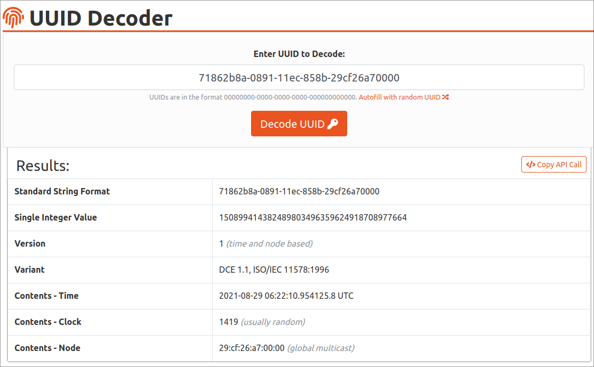
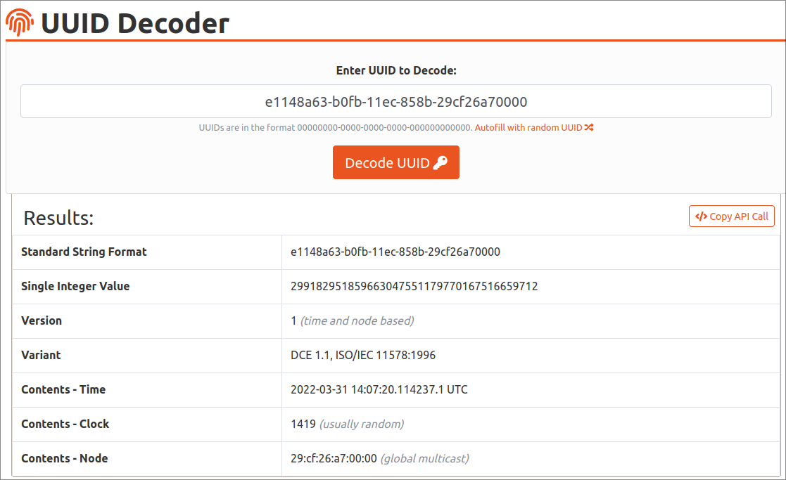
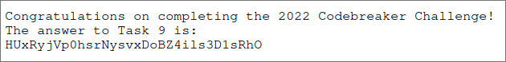

# Task 9 - The End of the Road

<div align="center">


</div>

> Unfortunately, looks like the ransomware site suffered some data loss, and doesn't have the victim's key to give back! I guess they weren't planning on returning the victims' files, even if they paid up.
>
> There's one last shred of hope: your cryptanalysis skills. We've given you one of the encrypted files from the victim's system, which contains an important message. Find the encryption key, and recover the message.
>
> Downloads:
>
> - Encrypted file recovered from the victim's system ([important_data.pdf.enc](./provided/important_data.pdf.enc))
>
> Prompt:
>
> - Enter the value recovered from the file

## Solution

How convenient that the ransomware site selectively lost the key to decrypt the file we needed :)
I guess this will be a bit harder than just directly decrypting the file and being done.

So, what do we do from here?
Well for starters we found [the script](../task-A2/tool-recovery/tools/ransom.sh) the attacker likely used to encrypt our victim's files in task A2:

```sh
#!/bin/sh
read -p "Enter encryption key: " key
hexkey=`echo -n $key | ./busybox xxd -p | ./busybox head -c 32`
export hexkey
./busybox find $1 -regex '.*\.\(pdf\|doc\|docx\|xls\|xlsx\|ppt\|pptx\)' -print -exec sh -c 'iv=`./openssl rand -hex 16`; echo -n $iv > $0.enc; ./openssl enc -e -aes-128-cbc -K $hexkey -iv $iv -in $0 >> $0.enc; rm $0' \{\} \; 2>/dev/null
```

I didn't actually find this script initially, so I ended up assuming that the PDF was encrypted with AES-256-CBC like the keys in the keyMaster database. Obviously this was incorrect, so I ended up banging my head against a wall for a couple of days until I thought to look back through old tasks :)

Anyways, from this script we know that our file (a PDF document) was encrypted with AES-128 in CBC mode (not AES-256 as I assumed) with a random IV.
We also know that both the encryption key and IV are provided in a hexadecimal representation (through the `xxd -p` and `./openssl rand -hex 16` commands, respectively). The key is truncated to 32 hex characters (`head -c 32`), which is also 16 bytes, or 16 ASCII characters. The IV, on the other hand, is prepended to the encrypted file contents (`echo -n $iv > $0.enc`).

Let's actually check out a hex dump of the file in case we can read the IV from that:

```shell
$ xxd -len 64 important_data.pdf.enc
00000000: 6331 3530 3435 6639 3938 3539 6435 6361  c15045f99859d5ca
00000010: 3933 3836 3137 6562 6334 3932 3332 3134  938617ebc4923214
00000020: e341 0564 3508 566b 9f5e 516c 25cc 8c8e  .A.d5.Vk.^Ql%...
00000030: fd57 43d1 faa4 7a68 148e c4af c8e7 8e33  .WC...zh.......3
```

Hmm, those first two rows of characters on the right look interesting :)
Instead of being garbage like the rest of the file, they're all valid hex characters, which means we probably have our encryption IV!
I guess the `echo` command just echoed the hex string to the file, since that is what's stored in the `$iv` variable.

How about the key though? It's not included in the encrypted file or anything, so we'll have to find it through some other means.
Luckily as part of task 8 we were able to decrypt [all of the keys](../task8/recovered/decrypted-keys.txt) in the ransomware site's storage, so we can use them as a starting point.
Let's take a look at a few of them:

```text
 cid  ->               key
=========================================
23445 -> 71862b8a-0891-11ec-858b-29cf26a7
41855 -> 1a6a7391-e0fc-11eb-858b-29cf26a7
27158 -> e5616d78-f23e-11eb-858b-29cf26a7
48048 -> baa9ac2e-0550-11ec-858b-29cf26a7
32689 -> f8e12a70-7391-11eb-858b-29cf26a7
```

[While going through the interesting functions in task 8](https://github.com/5t0n3/nsa-codebreaker-22/tree/main/task8#maindcho32cddk0), I mentioned that the `keyMaster` binary was generating version 1 UUIDs, although I didn't really explain what that meant.
Rather than boring you by quoting [RFC 4122](https://www.rfc-editor.org/rfc/rfc4122) repeatedly, I'll just use an [online tool](https://www.uuidtools.com/decode) to explain with one of the examples from above:

<div align="center">

</div>

This confirms that we do in fact have a version 1 UUID, which this website says is time and node based.
This website also gives us the time that the UUID was generated at, which we can cross-reference with the [key generation log](../task8/recovered/keygeneration.log):

```text
2021-08-29T02:22:20-04:00   LudicrousBlood  23445   6.686
```

Hmm...they are pretty close but the log has a time about 9 seconds later than the time the UUID was generated at.
When I first did this task I just eyeballed the largest difference, but for the sake of science I decided to write up [a Python program](./log_diffs.py) to find more exact bounds for these differences:

```python
$ python log_diffs.py
Maximum log/UUID difference: 11.854384 seconds
Minimum log/UUID difference: 6.375123 seconds
```

Some inaccuracy is expected since the microseconds are removed from the timestamps before logging them, but 6 seconds is still a pretty substantial delay so I wonder where that came from.
Because the log times are so inaccurate though, we can't directly reconstruct our encryption key from the time there.
What we can do is bound the potential times our key could have been generated at, and if that doesn't work then we can expand our range a bit.
I decided to round the bounds to 6 and 12 seconds before the log time, mostly because those are nicer times to work with :)

Reviewing the key generation log time for our victim:

```text
2022-03-31T10:07:28-04:00   X-RatedSnowboarding 64187   2.88
```

So that means we're going to be searching from 10:07:16 to 10:07:22, which is a six second range. Hopefully that won't be too bad :)

To convert these timestamps to UUIDs, I wrote [another Python program](./uuid_bounds.py) since I wasn't able to find any online tools to do so :) Again looking at the result:

```shell
$ python uuid_bounds.py
Upper bound UUID (6 seconds before): e2344900-b0fb-11ec-858b-29cf26a7
Lower bound UUID (12 seconds before): dea0c200-b0fb-11ec-858b-29cf26a7
```

And there's our range of the keys generated by the server!
These aren't our encryption keys, though; remember how I mentioned earlier that the keys were truncated to the first 16 bytes?
Pulling the relevant line of the ransom script back up:

```sh
hexkey=`echo -n $key | ./busybox xxd -p | ./busybox head -c 32`
```

Let's try running that with one of our boundary keys (note that we don't need busybox since we already have these commands available):

```shell
$ hexkey=$(echo -n e2344900-b0fb-11ec-858b-29cf26a7 | xxd -p | head -c 32)

# convert back to ASCII
$ echo -n $hexkey | xxd -r -p
e2344900-b0fb-11
```

So that means that our actual key range is `dea0c200-b0fb-11` to `e2344900-b0fb-11`. I guess we didn't need the clock sequence/node after all :)

### Key verification

That was a lot of information, so let's do some more recap of what we know :)

- Encryption algorithm: AES-128 in CBC mode
- IV: `c15045f99859d5ca938617ebc4923214` (hex)
- Key range: between `dea0c200-b0fb-11` and `e2344900-b0fb-11`
- File type: PDF (assuming the file isn't named misleadingly haha)

That last point actually gives us a way to verify if we have the correct encryption key.
A lot of file formats have what are called [magic numbers](https://en.wikipedia.org/wiki/File_format#Magic_number), which are arbitrary byte sequences that indicate what type of file they are.
For example, the `keyMaster` binary from task 8 is an ELF binary, meaning it starts with the bytes `7f 45 4c 46` (or `7f ELF`):

```shell
$ xxd -len 4 ../task8/recovered/keyMaster
00000000: 7f45 4c46                                .ELF
```

Another one I find funny is the magic for Java class files :)

```shell
$ xxd -len 4 Test.class
00000000: cafe babe                                ....
```

This is actually part of how the `file` command works, although it obviously does more than just check the magic of a file :)

Tangent aside, all PDF files start with the magic sequence `%PDF` (or `25 50 44 46` in hex), which we can use to verify if we've successfully decrypted the PDF we're given.
This also provides us with a useful shortcut: instead of attempting to decrypt the whole PDF file with every key, we just have to decrypt the first encrypted 16-byte block and check if it starts with `%PDF`.

### Decryption time

With all of that information in hand, we can finally get around to brute forcing the key range we found earlier.
I initially did this [in Python](./solving/bruteforce.py), but that script took 13 minutes to find the right key which is forever :)
After the fact, I ended up writing brute force scripts in [Rust](./solving/task9-rs/src/main.rs) and [C](./solving/task9-c/task9.c) because I got bored and was curious how much faster they'd be, and it turns out that both are a lot faster:

```
$ task9-rs
Key: e1148a63-b0fb-11
Decrypted data: %PDF-1.4\n%�쏢\n5
Took 0.502 seconds to brute force.

$ task9-c
Key: e1148a63-b0fb-11
Decrypted data: %PDF-1.4
%�
5
Took 8.114 seconds to brute force.
```

But anyways, I'm getting ahead of myself :) All three programs follow a similar approach, though, so I'll explain that.

Because it's only the first eight digits of the keys in our range that differ, I represent the key range by iterating over every integer from `0xdea0c200` to `0xe2344900` and prepending each one to the string `-b0fb-11`.
With each key, I decrypt the first (non-IV) block of important_data.pdf.enc (`e34105643508566b9f5e516c25cc8c8e` in hex) using AES-128-CBC with the IV at the beginning of the PDF file (`c15045f99859d5ca938617ebc4923214` hex).
If the first four bytes of the decrypted block match the PDF magic (`%PDF`), I print the key and decrypted block and stop iterating over keys.

Rust is really nice since I can use the [rayon](https://github.com/rayon-rs/rayon) crate to easily parallelize the key testing process, which is probably at least part of the reason why it's so much faster than the C & Python brute forcers.

After running any of the scripts, you'll obviously get the encryption key as shown above: `e1148a63-b0fb-11`.
Turning that back into a full UUID:

<div align="center">

</div>

So that means our key was generated about 7.9 seconds before the log timestamp (`2022-03-31T10:07:28-04:00`). Good thing that fell in our approximation range :)

With our key in hand, we can finally decrypt the PDF file (after removing the IV at the beginning, of course):

```shell
$ tail -c +33 important_data.pdf.enc > important_data.pdf.trunc
$ export hexkey=$(echo -n e1148a63-b0fb-11 | xxd -p)
$ openssl enc -d -aes-128-cbc -K $hexkey -iv c15045f99859d5ca938617ebc4923214 -in important_data.pdf.trunc > important_data.pdf
```

And now we have our [decrypted PDF](./important_data.pdf)!

<div align="center">

</div>

Huh, that's weird that they'd mention the Codebreaker Challenge in an important PDF from a totally unrelated company :)
Jokes aside though, that gives us our value to submit: `HUxRyjVp0hsrNysvxDoBZ4ils3D1sRhO`.

This whole challenge has been a lot of fun (if frustrating at times), and I definitely learned a lot from it, especially given that this was my first Codebreaker Challenge. I hope you got something out of these writeups and that they all made at least some sense haha

'Till next year I guess! :)
